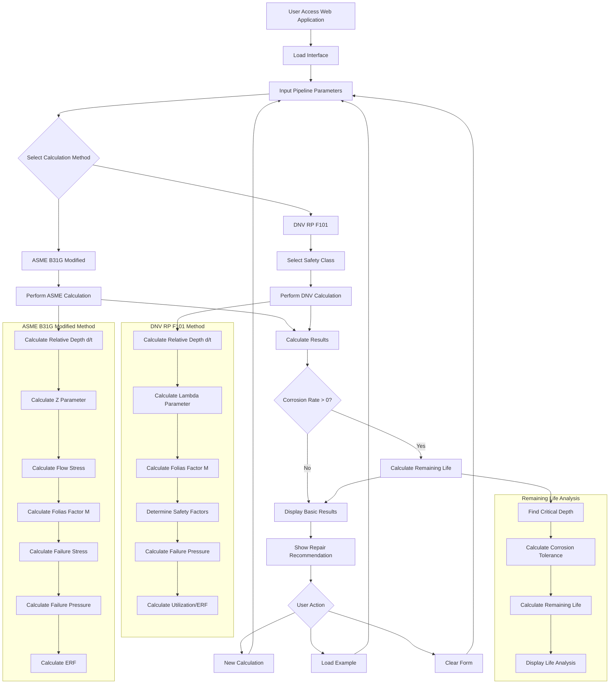

# Pipeline Fitness-For-Service Assessment Tool

Web application for assessing corroded pipelines using industry standards.

🌐 **Live Demo**: [https://pipeline-ffs.ew.r.appspot.com](https://pipeline-ffs.ew.r.appspot.com)

## About

This tool helps engineers evaluate the safety of pipelines with corrosion defects. It calculates whether a pipeline is safe to operate or needs repair based on ASME B31G and DNV RP F101 standards.

## Features

- ✅ **ASME B31G 2012 Modified** calculations
- ✅ **DNV RP F101** assessments  
- ✅ **Remaining life** estimation
- ✅ **Interactive web interface**
- ✅ **Real-time results**

## Quick Start

### Local Installation

1. **Install dependencies**
```bash
pip install -r requirements.txt
```

2. **Run the application**
```bash
python main.py
```

3. **Open in browser**
```
http://localhost:8080
```

## Workflow



## Usage Example

1. Select assessment method (ASME or DNV)
2. Enter pipeline parameters
3. Input defect dimensions
4. Click "Calculate"
5. View results including safety factor and remaining life

## User interface 
Input data 


Results 


## Calculation Methods

### ASME B31G Modified
- Industry standard for corroded pipelines
- Calculates Estimated Repair Factor (ERF)
- ERF < 1.0 = Safe to operate
- ERF ≥ 1.0 = Repair required

### DNV RP F101  
- Includes safety classes (Low, Medium, High)
- Reliability-based approach
- Material and design factors

## Project Structure

```
pipeline-ffs/
├── main.py          # Flask application
├── app.yaml         # Google Cloud config
├── requirements.txt # Python dependencies
└── templates/
    └── index.html   # Web interface
```

## Deployment

### Google App Engine
```bash
gcloud app deploy
```

## Author

**Eduard Ibragimov**  
Email: ibragimov.e@outlook.com  
GitHub: [@Eduard-Ibr](https://github.com/Eduard-Ibr)

## License

MIT License - see [LICENSE](LICENSE) file.

## Disclaimer

This tool is for educational purposes. Always consult qualified engineers for critical pipeline assessments.
```
